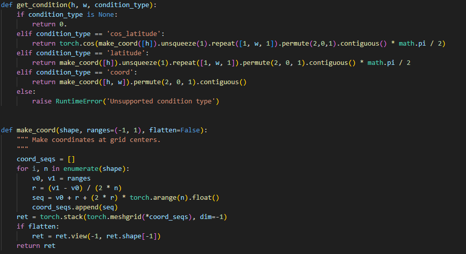
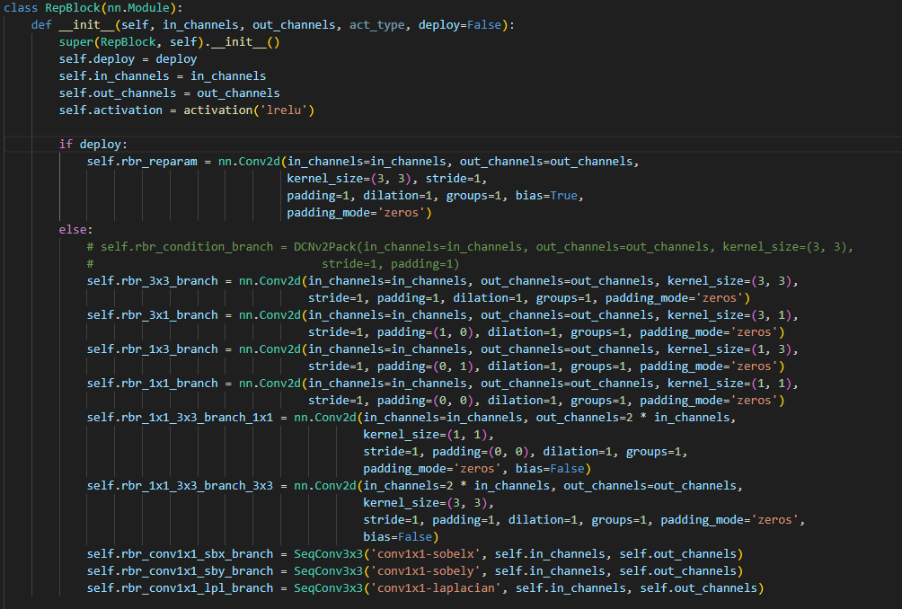

## Lightweight Omnidirectional Super-Resolution via Frequency-Spatial Fusion and ERP Correction


Dezhi Li, Yonglin Chen, Xingbo Dong, Tiong-Sik Ng, Zhe Jin,  Shengyuan Wang, and Wen Sha


> **Abstract:**  Omnidirectional images (ODIs) possess unique equirectangular projection (ERP) geometric prop
erties that pose challenges for traditional super-resolution methods. Existing ODI super-resolution
 (ODISR) models often struggle to effectively capture both spatial and frequency domain information,
 limiting their performance. In this work, we introduce a lightweight model that fuses information
 from both domains to enhance ODISR. A dual-domain attention mechanism tailored for ODISR is
 proposed, incorporating a reparameterized pixel attention module and a frequency-domain attention
 module. This approach achieves a balance between efficiency and reconstruction quality, reducing
 both time and space complexity. Experiments demonstrate that our model outperforms state-of-the
art lightweight ODISR models while maintaining competitive performance. 

<p align="center">
    
</p>

⭐If this work is helpful for you, please help star this repo. Thanks!🤗


## 📑 Contents

- [Results](#results)
- [Model Summary](#model_summary)
- [Installation](#installation)
- [Training](#training)
- [Testing](#testing)
- [Algorithm Details](#algorithm_details)


## <a name="results"></a> 🥇 Results

We achieve state-of-the-art performance on various image restoration tasks. Detailed results can be found in the paper.


<details>
<summary>Presentation of Results (click to expand)</summary>

<p align="center">
  
</p>
</details>


## <a name="model_summary"></a> :page_with_curl: Model Summary

|       Method       | Scale | Params(k) | MACs(GMAC) |       |        |  ODI-SR |         |          |           |       |        |   SUM   |         |          |           |
|:------------------:|:-----:|:---------:|:----------:|:-----:|:------:|:-------:|:-------:|----------|-----------|:-----:|:------:|:-------:|:-------:|----------|-----------|
|                    |       |           |            |  PSNR |  SSIM  | WS-PSNR | WS-SSIM | RS-Score | WRS-Score |  PSNR |  SSIM  | WS-PSNR | WS-SSIM | RS-Score | WRS-Score |
|   VDSR(2016cvpr)   |   x2  |   672.27  |    2.76    | 29.92 |  0.867 |  29.37  |  0.8653 |   7.94   |   7.78    | 30.29 | 0.8645 |  30.75  |  0.8887 |   8.01   |   8.36    |
| LapSRN（2017CVPR） |   x2  |   437.7   |    2.62    | 29.92 | 0.8668 |  29.38  |  0.8653 |   8.48   |   8.31    | 30.29 | 0.8643 |  30.77  |  0.8888 |   8.56   |   8.94    |
|   CARN(2018ECCV)   |   x2  |   722.77  |    2.97    | 30.08 | 0.8703 |  29.53  |  0.8685 |   7.86   |   7.70    | 30.56 | 0.8695 |   31.1  |  0.8934 |   7.98   |   8.34    |
|   IMDN(2019ACMMM)  |   x2  |   694.4   |    2.84    | 29.85 | 0.8697 |  29.28  |  0.8686 |   7.88   |   7.72    | 30.28 | 0.8676 |  30.76  |  0.8926 |   7.97   |   8.33    |
|   SCPA(2020ECCV)   |   x2  |   527.05  |    2.17    | 30.07 | 0.8698 |  29.53  |  0.8682 |   8.55   |   8.38    | 30.52 | 0.8687 |  31.07  |  0.893  |   8.67   |   9.07    |
|   ESDB(2022CVPRW)  |   x2  |   293.14  |    1.17    | 29.75 | 0.8696 |  29.13  |  0.8679 |  10.20   |   9.97    | 30.25 | 0.8681 |  30.63  |  0.892  |  10.36   |   10.78   |
|   EDSR(2023ICCV)   |   x2  |  1204.35  |      /     | 28.95 | 0.8508 |  28.39  |  0.8486 |     /    |     /     | 28.91 | 0.8413 |  28.95  |  0.8632 |     /    |     /     |
|   SAFMN(2023ICCV)  |   x2  |   621.61  |    2.54    | 30.08 | 0.8706 |  29.53  |  0.8688 |   8.19   |   8.02    | 30.54 | 0.8697 |  31.07  |  0.8935 |   8.30   |   8.68    |
|  RepRFN(2023cvprw) |   x2  |   587.62  |    2.34    | 30.11 | 0.8704 |  29.56  |  0.8685 |   8.35   |   8.18    |  30.6 | 0.8698 |  31.15  |  0.8938 |   8.48   |   8.87    |
|        OSRT*       |   x2  |   209.86  |    0.59    | 29.95 | 0.8683 |  29.39  |  0.8662 |  12.43   |   12.16   | 30.36 | 0.8666 |  30.78  |  0.8899 |  12.57   |   13.09   |
|        Ours*       |   x2  |   124.81  |    0.48    | 30.03 | 0.8692 |  29.47  |  0.8674 |  14.68   |   14.38   | 30.43 | 0.8678 |  30.91  |  0.8917 |  14.86   |   15.51   |
|   VDSR(2016cvpr)   |   x4  |   693.04  |    0.71    | 26.74 | 0.7541 |   26.1  |  0.7397 |   7.49   |   7.17    | 26.82 |  0.753 |  26.67  |  0.7709 |   7.50   |   7.64    |
| LapSRN（2017CVPR） |   x4  |   463.66  |    0.76    | 26.78 | 0.7546 |  26.14  |  0.7403 |   7.93   |   7.60    | 26.89 | 0.7544 |  26.76  |  0.7727 |   7.96   |   8.12    |
|   CARN(2018ECCV)   |   x4  |   742.25  |    0.76    | 26.86 | 0.7583 |  26.22  |  0.7442 |   7.40   |   7.09    | 27.05 | 0.7599 |  26.93  |  0.7787 |   7.47   |   7.62    |
|   IMDN(2019ACMMM)  |   x4  |   715.18  |    0.73    | 26.78 | 0.7589 |  26.12  |  0.7452 |   7.48   |   7.16    | 26.96 | 0.7604 |  26.82  |  0.7796 |   7.54   |   7.69    |
|   SCPA(2020ECCV)   |   x4  |   830.52  |    0.83    | 26.88 | 0.7584 |  26.23  |  0.7444 |   7.18   |   6.88    | 27.06 | 0.7602 |  26.95  |  0.7791 |   7.25   |   7.40    |
|   ESDB(2022CVPRW)  |   x4  |   312.61  |    0.31    | 26.88 | 0.7591 |  26.22  |  0.7451 |  10.27   |   9.84    | 27.07 | 0.7609 |  26.93  |  0.7797 |  10.37   |   10.57   |
|   EDSR(2023ICCV)   |   x4  | 1334.19   |      /     | 24.88 | 0.7107 |  24.36  |  0.6983 |     /    |     /     |  24.6 | 0.7084 |  24.34  |  0.7189 |     /    |     /     |
|   SAFMN(2023ICCV)  |   x4  |   641.09  |    0.65    | 26.91 | 0.7595 |  26.26  |  0.7456 |   7.80   |   7.47    | 27.08 | 0.7605 |  26.96  |  0.7794 |   7.86   |   8.02    |
|  RepRFN(2023cvprw) |   x4  |   736.94  |    0.74    | 26.89 | 0.7588 |  26.25  |  0.7448 |   7.46   |   7.14    | 27.08 | 0.7608 |  26.96  |  0.7799 |   7.53   |   7.68    |
|        OSRT*       |   x4  |   229.33  |    0.17    | 26.83 | 0.7544 |  26.19  |  0.7398 |  12.72   |   12.18   | 26.92 | 0.7525 |  26.75  |  0.7696 |  12.73   |   12.94   |
|        Ours*       |   x4  |   134.57  |    0.13    | 26.87 | 0.7564 |  26.23  |  0.7422 |  16.35   |   15.66   | 26.99 | 0.7562 |  26.85  |  0.7741 |  16.42   |   16.72   |
|   VDSR(2016cvpr)   |   x8  |   776.13  |     0.2    | 24.73 | 0.6733 |  24.04  |  0.6464 |   7.60   |   7.09    | 24.42 | 0.6672 |  24.01  |  0.6702 |   7.44   |   7.34    |
| LapSRN（2017CVPR） |   x8  |   463.66  |    0.19    | 24.76 | 0.6746 |  24.08  |  0.6477 |   8.59   |   8.02    | 24.48 | 0.6693 |  24.07  |  0.6782 |   8.42   |   8.39    |
|   CARN(2018ECCV)   |   x8  |   820.15  |    0.21    | 24.83 | 0.6783 |  24.14  |  0.6519 |   7.53   |   7.04    | 24.63 | 0.6757 |  24.22  |  0.6806 |   7.44   |   7.37    |
|   IMDN(2019ACMMM)  |   x8  |   798.26  |     0.2    | 24.77 | 0.6775 |  24.07  |  0.6515 |   7.62   |   7.12    | 24.53 | 0.6738 |  24.14  |  0.6788 |   7.50   |   7.44    |
|   SCPA(2020ECCV)   |   x8  |   908.42  |    0.23    | 24.84 | 0.6784 |  24.16  |  0.652  |   7.26   |   6.79    | 24.63 | 0.6753 |  24.23  |  0.6799 |   7.17   |   7.10    |
|   ESDB(2022CVPRW)  |   x8  |   390.52  |     0.1    | 24.76 | 0.6756 |  24.07  |  0.6494 |  10.51   |   9.82    | 24.49 | 0.6716 |  24.09  |  0.676  |  10.33   |   10.23   |
|   EDSR(2023ICCV)   |   x8  |  1464.03  |      /     | 24.34 | 0.6531 |  23.64  |  0.6234 |     /    |     /     | 23.81 | 0.6375 |  23.32  |  0.634  |     /    |     /     |
|   SAFMN(2023ICCV)  |   x8  |   718.99  |    0.18    | 24.65 | 0.6739 |  23.96  |  0.6474 |   7.87   |   7.34    | 24.45 | 0.6716 |  24.01  |  0.6755 |   7.77   |   7.68    |
|  RepRFN(2023cvprw) |   x8  |   814.84  |     0.2    |  24.4 | 0.6601 |  23.96  |  0.6306 |   7.28   |   6.83    | 24.04 |  0.651 |  23.55  |   0.65  |   7.07   |   6.92    |
|        OSRT*       |   x8  |   307.24  |    0.06    |  24.8 | 0.6751 |  24.11  |  0.6479 |  13.23   |   12.34   | 24.53 | 0.6689 |  24.08  | 0.6716  |  12.96   |   12.78   |
|        Ours*       |   x8  |   173.59  |    0.04    | 24.82 | 0.6765 |  24.12  |  0.6495 |  19.95   |   18.61   | 24.59 | 0.6718 |  24.15  | 0.6751  |  19.63   |   19.37   |


## <a name="installation"></a> :wrench: Installation

This codebase was tested with the following environment configurations. It may work with other versions.

- Ubuntu 20.04
- CUDA 11.7
- Python 3.9
- PyTorch >= 1.7
- BasicSR

### Installation


```
pip install -r requirements.txt
```

### Data Preparation
1. Download lau dataset [here](https://drive.google.com/drive/folders/1w7m1r-yCbbZ7_xMGzb6IBplPe4c89rH9?usp=sharing).
```bash
mkdir datasets
ln -s YOUR_LAU_DATASET_PATH datasets/lau_dataset
```
2. Clean dataset.
```bash
python odisr/utils/make_clean_lau_dataset.py
```
3. Crop training patches
```bash
python odisr/utils/extract_subimage.py
```
4. Build DF2K-ODI augmentation dataset from DF2K ([DIV2K](https://data.vision.ee.ethz.ch/cvl/DIV2K/)/ [Flickr2K](https://github.com/LimBee/NTIRE2017))
```bash
ln -s YOUR_DIV2K_TRAINSET_PATH datasets/DIV2K_train_HR
ln -s YOUR_FLICKR2K_TRAINSET_PATH datasets/Flickr2K_HR
python odisr/utils/make_augmentation_dataset.py
```
As DF2K-ODI is already consisted of image patches, cropping patches for lau datasets is __NECESSARY__ when training with this dataset.
Maximum `gt_size` for DF2K-ODI is 256.

## <a name="training"></a>  :hourglass: Training
We provide training options of RepSC-PA on X2, X4 and X8 SR.

All comparison models on X4 SR is available.

Training RepSC-PA:
```bash
CUDA_VISIBLE_DEVICES=0,1,2,3,4,5,6,7 python -m torch.distributed.launch --nproc_per_node=8 --master_port=7777 train.py -opt ./options/train/*.yml --launcher pytorch
```

We provide [trained models](https://pan.baidu.com/s/13DccC5bLNtngrbc50KAtVg?pwd=1234).


## <a name="testing"></a> :smile: Testing

Testing RepSC-PA:
```bash
ln -s YOUR_PRETRAIN_MODEL_PATH pretrained_models
CUDA_VISIBLE_DEVICES=0 python test.py -opt ./options/test/*.yml
```
For the calculation of the number of parameters and the amount of computation, we provide interference.py. You only need to change the corresponding parameters of the model

## <a name="algorithm_details"></a> :page_with_curl: Algorithm Details
If you want to change the model, add the other models to /odisr/archs. We will briefly introduce our algorithm and implementation.

1.Distortion map
The transformation from fisheye image to ERP image introduces distortion, to which we leverage the Jacobian determinant Equation to establish a similar area ratio between the fish-eye lens-captured image and the ERP image. You will find it in /odisr/data/erp_paired_image_dataset.py.

<p align="center">
    
</p>

2.Reparameterized Block
To extract features of varying patterns, we employ convolution through multiple parallel convolutions with diverse receptive fields and edge-oriented convolution modules. Additionally, we utilize residual connections to aggregate features, thereby enhancing feature representation capability. RepBlock is based on the module in RepRFN, which you can find it in /odisr/archs/rfpoub.py.

<p align="center">
    
</p>

3.Frequency Domain Feature Module
Since FAM is not open source, we built a plug-in FAM module to extract features in the frequency domain.


## Acknowledgement
This code is based on [BasicSR](https://github.com/XPixelGroup/BasicSR), and [OSRT](https://github.com/Fanghua-Yu/OSRT). Thanks for their awesome work.


