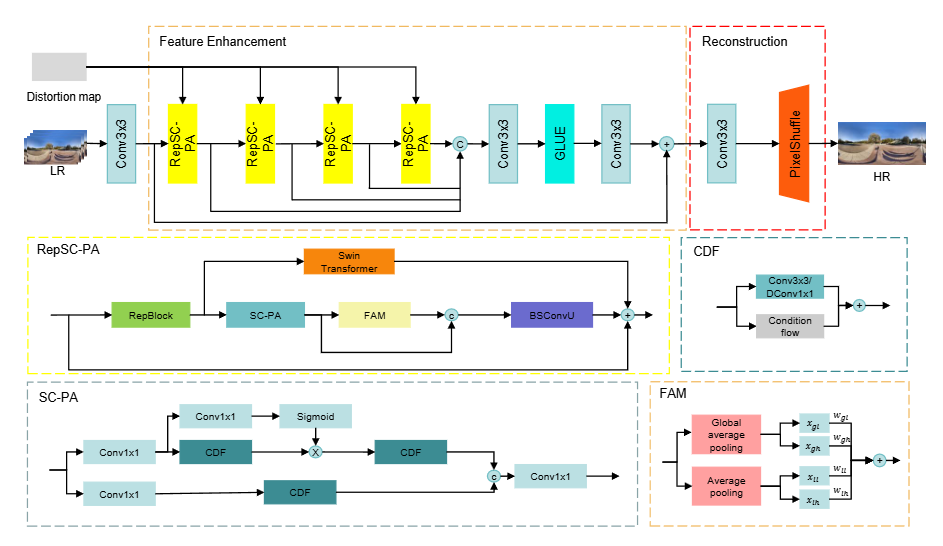
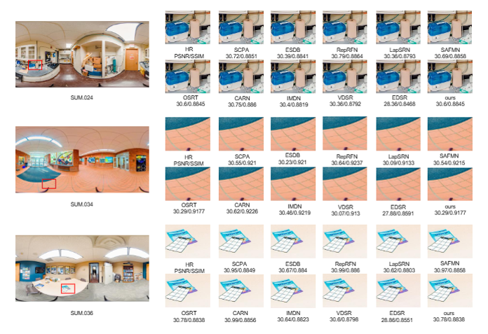
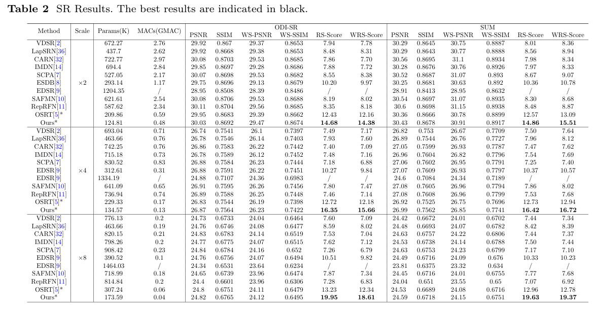

## Lightweight Omnidirectional Super-Resolution via Frequency-Spatial Fusion and ERP Correction


Dezhi Li, Yonglin Chen, Xingbo Dong, Tiong-Sik Ng, Zhe Jin,  Shengyuan Wang, and Wen Sha


> **Abstract:**  Omnidirectional images (ODIs) possess unique equirectangular projection (ERP) geometric prop
erties that pose challenges for traditional super-resolution methods. Existing ODI super-resolution
 (ODISR) models often struggle to effectively capture both spatial and frequency domain information,
 limiting their performance. In this work, we introduce a lightweight model that fuses information
 from both domains to enhance ODISR. A dual-domain attention mechanism tailored for ODISR is
 proposed, incorporating a reparameterized pixel attention module and a frequency-domain attention
 module. This approach achieves a balance between efficiency and reconstruction quality, reducing
 both time and space complexity. Experiments demonstrate that our model outperforms state-of-the
art lightweight ODISR models while maintaining competitive performance. 

<p align="center">
    
</p>

⭐If this work is helpful for you, please help star this repo. Thanks!🤗


## 📑 Contents

- [Results](#results)
- [Installation](#installation)
- [Training](#training)
- [Testing](#testing)


## <a name="results"></a> 🥇 Results

We achieve state-of-the-art performance on various image restoration tasks. Detailed results can be found in the paper.


<details>
<summary>Presentation of Results (click to expand)</summary>

<p align="center">
  
</p>
</details>


<details>
<summary>Contrast experiment (click to expand)</summary>

<p align="center">
  
</p>
</details>


## <a name="installation"></a> :wrench: Installation

This codebase was tested with the following environment configurations. It may work with other versions.

- Ubuntu 20.04
- CUDA 11.7
- Python 3.9
- PyTorch >= 1.7
- BasicSR

### Installation


```
pip install -r requirements.txt
```

### Data Preparation
1. Download lau dataset [here](https://drive.google.com/drive/folders/1w7m1r-yCbbZ7_xMGzb6IBplPe4c89rH9?usp=sharing).
```bash
mkdir datasets
ln -s YOUR_LAU_DATASET_PATH datasets/lau_dataset
```
2. Clean dataset.
```bash
python odisr/utils/make_clean_lau_dataset.py
```
3. Crop training patches
```bash
python odisr/utils/extract_subimage.py
```
4. Build DF2K-ODI augmentation dataset from DF2K ([DIV2K](https://data.vision.ee.ethz.ch/cvl/DIV2K/)/ [Flickr2K](https://github.com/LimBee/NTIRE2017))
```bash
ln -s YOUR_DIV2K_TRAINSET_PATH datasets/DIV2K_train_HR
ln -s YOUR_FLICKR2K_TRAINSET_PATH datasets/Flickr2K_HR
python odisr/utils/make_augmentation_dataset.py
```
As DF2K-ODI is already consisted of image patches, cropping patches for lau datasets is __NECESSARY__ when training with this dataset.
Maximum `gt_size` for DF2K-ODI is 256.

## <a name="training"></a>  :hourglass: Training
We provide training options of RepSC-PA on X2, X4 and X8 SR.

All comparison models on X4 SR is available.

Training RepSC-PA:
```bash
CUDA_VISIBLE_DEVICES=0,1,2,3,4,5,6,7 python -m torch.distributed.launch --nproc_per_node=8 --master_port=7777 train.py -opt ./options/train/*.yml --launcher pytorch
```


## <a name="testing"></a> :smile: Testing

Testing RepSC-PA:
```bash
ln -s YOUR_PRETRAIN_MODEL_PATH pretrained_models
CUDA_VISIBLE_DEVICES=0 python test.py -opt ./options/test/*.yml
```
For the calculation of the number of parameters and the amount of computation, we provide interference.py. You only need to change the corresponding parameters of the model


## Acknowledgement
This code is based on [BasicSR](https://github.com/XPixelGroup/BasicSR), and [OSRT](https://github.com/Fanghua-Yu/OSRT). Thanks for their awesome work.


